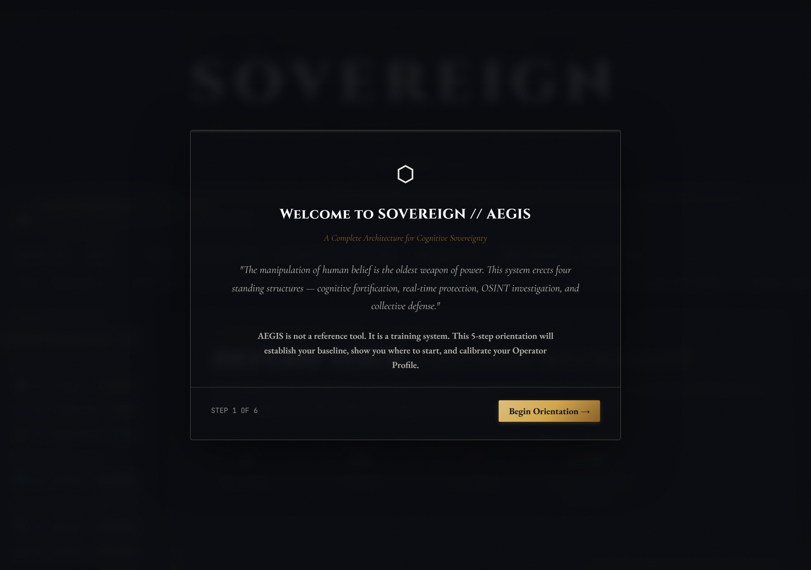
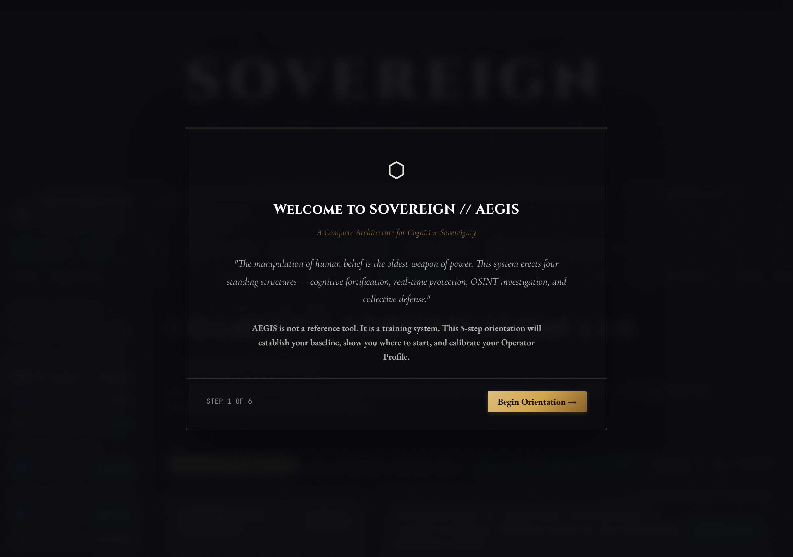
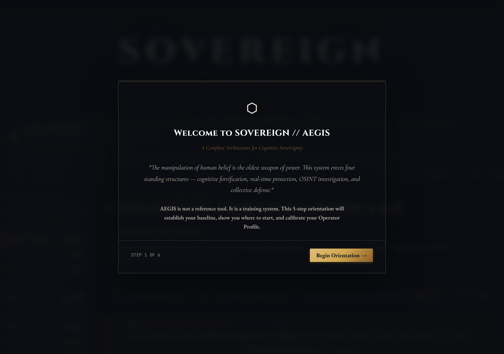
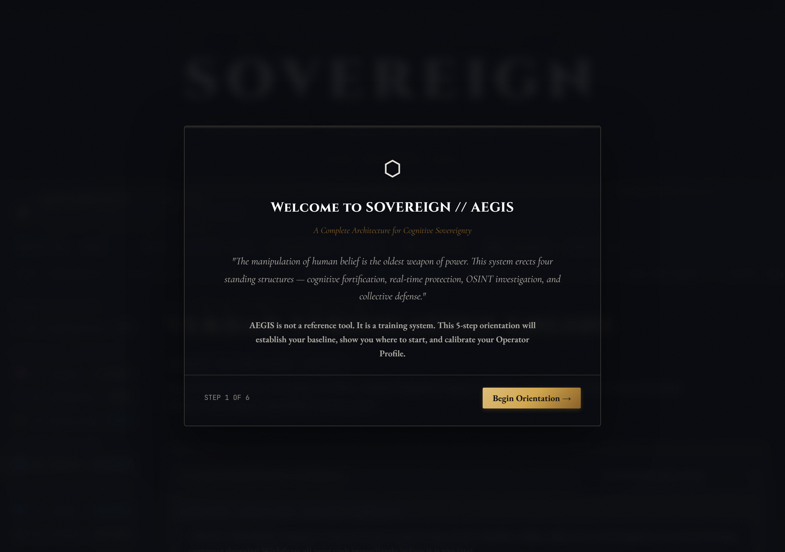
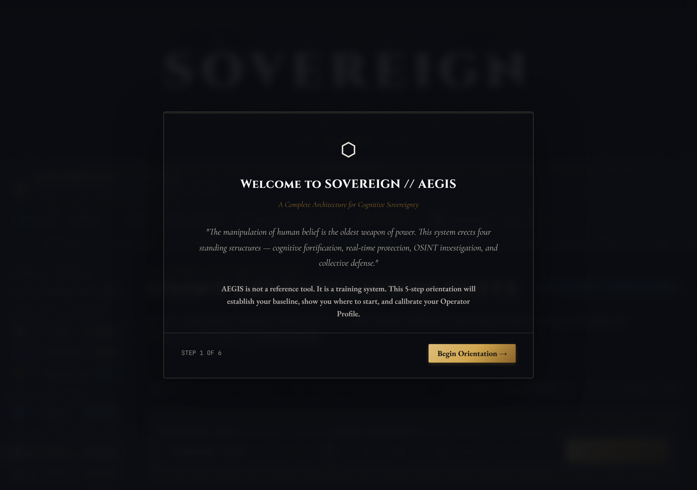

# SOVEREIGN // AEGIS

**An offline-first, browser-native epistemic-defense training suite.** AEGIS teaches you to
detect manipulation, verify claims, and reason under pressure — and it measures whether you
actually learned, using real attempt data and Bayesian skill estimation instead of gamified
vanity numbers.

No framework. No build step. No runtime dependencies. No telemetry. Everything stays on your machine.

[](https://github.com/dribblejerp-KlunkDunker/Sovereign-Aegis/actions/workflows/ci.yml)
[](#license)
[](#run-it)


---

## What it is

Four training pillars on a shared assessment foundation:

| Pillar | What you train | Highlights |
|---|---|---|
| **I — Cognitive Fortification** | Argument analysis and memory | SIFT Labs, 60-Second Triage, Fallacy Gauntlet, Rhetorical Sandbox, SM-2 Memory Vault |
| **II — Real-Time Protection** | Live claim and source triage | VERDAD dialectic engine, adversarial sandbox, source dossiers, prebunking/inoculation |
| **III — Signal & OSINT Forensics** | Media and intelligence analysis | ELA / 2D FFT / STFT spectrogram, C2PA provenance parsing, Heuer ACH matrix, OSINT case drills |
| **IV — Collective Defense** | Systems-level resilience | InfoWar SEIR wargame, Epistemic Commons (hardened community packs), narrative simulations |

**The foundation** is the part most apps skip: every answer you give anywhere in the suite is
recorded to a local, append-only attempt log and routed through a competency spine of 24 named
skills — Bayesian mastery estimates, confidence calibration (Brier score), held-out-item
transfer probing, and adaptive routing to your weakest skills. The suite tracks what it cannot
conclude as honestly as what it can.

## A tour of the four pillars

Every shot below is the real app running headless at 1280×900 — captured live by
`node tools/capture-screenshots.mjs` (serve first with `node serve.mjs`).

### The command deck

The overview hub — mission status, per-pillar entry points, and your operator profile with
the Resilience Index computed from real attempt data (or honestly absent when there isn't
enough of it yet).



### Pillar I — Cognitive Fortification Lab

SIFT Labs, 60-Second Triage, the Fallacy Gauntlet, Rhetorical Sandbox, and the SM-2 Memory
Vault — argument analysis and memory training with every answer flowing into the competency
spine.



### Adaptive inoculation (Pillar I, Prebunking subtab)

The Personal Defense Profile's scenario engine: personalized inoculation runs that show you
*why* each scenario was served, and write real attempts back to the spine.



### Pillar II — VERDAD Verification Engine

Live claim triage: heuristic manipulation analysis, dialectic argument mapping, source
dossiers, and optional BYOK fact-check lookup — degrading honestly to fully-offline
heuristics when no key is configured.



### Pillar III — OSINT Investigation Suite

Structured intelligence analysis: entity pivots, source assessment, and Heuer's ACH matrix
for competing-hypothesis work, with every case drill logged as a real attempt.



### Pillar IV — InfoWar Tactical Simulator

Systems-level resilience: an SEIR wargame over a networked information environment — watch
narratives propagate, deploy countermeasures, and see the second-order effects.


## Privacy model

- **Local-first by design.** Attempt logs, defense profiles, and keys live in IndexedDB /
  WebCrypto on your device. There is no cloud sync, no account, no analytics, and no phone-home
  for your data.
- **Non-extractable keys.** Your identity is an ECDSA P-256 keypair generated as
  non-extractable `CryptoKey` objects — the private key cannot be read out of the browser,
  only used to sign. Attestations are W3C Verifiable Credentials signed with it, offline.
- **Strict CSP.** `script-src 'self'`, no inline scripts, `object-src 'none'`, `base-uri 'none'`.
  The standalone build enforces this with SHA-256 hashes.
- **BYOK, optional.** The two outbound-API features (Verdad's LLM analysis, Google Fact Check
  lookup) are strictly opt-in: you paste your own API key, it is used for that request, and
  without a key everything degrades to fully-offline heuristics. The app works with airplane
  mode on.
- **Hardened imports.** Community case packs are sanitized on import *and* re-sanitized on load.

## Run it

The multi-file app has no build step — serve it statically and open it:

```bash
node serve.mjs          # → http://127.0.0.1:3000
# or: serve.cmd on Windows, or any static file server pointed at this directory
```

Opening `index.html` directly from `file://` does **not** work (ES modules are blocked by
browser policy) — use the server, or the standalone build below.

### Standalone single file

```bash
node build-standalone.mjs   # needs esbuild (npx resolves it; see note below)
```

This produces **`sovereign-aegis-standalone.html`** (~1.8 MB, ~496 KB gzipped): every JS module,
stylesheet, and dataset inlined into one auditable file with a hashed CSP and a fetch shim for
the embedded datasets. You can email it, put it on a USB stick, or open it straight from disk —
it is the whole suite, offline forever. (On Windows, `npx` spawning has a known quirk in this
repo's build script; `SESSION-HANDOFF.md` documents the `shell: true` workaround.)

## Test it

```bash
npm test                 # headless gate: 45 suites, ~17,350 assertions, 0 failures (~9 s)
npm run test:e2e         # browser E2E (headless Chromium CDP) — separate gate
npm run test:browser     # Playwright browser suite
node tools/tag-skills.mjs  # content-tagging gate: fails on untagged/degenerate items
node tools/capture-screenshots.mjs  # regenerate the README tour (app must be served; needs Playwright)
```

The headless gate deliberately reports its own composition (62% dataset/schema validation,
38% logic/crypto/fuzz/static-HTML) — inflated assertion counts are treated as a bug here.

## Honesty standard

Every number the UI displays is measured or estimated from real attempts — never simulated to
look alive. Mastery comes from your logged answers; calibration from your confidence choices;
transfer from held-out items you have never trained on. Where data is absent, the UI says so
("Not enough held-out attempts yet" — absence of a measurement is not a measurement of zero).

## Project docs

| Doc | Contents |
|---|---|
| `PROJECT.md` | Full architecture, feature inventory, and verified interface contracts |
| `ROADMAP.md` | Phases 1–7 and hardening leftovers (§8) |
| `AUDIT.md` | 2026-08 security audit and remediation log (XSS, keys, CSP, fonts) |
| `DESIGN-*.md` | Specs: competency spine, Personal Defense Profile, messenger seam, product decisions |
| `SESSION-HANDOFF.md` / `STATUS.md` | Current verified state and open items |
| `docs/transfer-study-preregistration.md` | Pre-registered protocol for the not-yet-run transfer study |

## Status

All four pillars, the competency spine, adaptive routing, retention machinery, and the
Personal Defense Profile are **built and gated** (2026-09). Open work is tracked, not hidden:
the Phase 4 transfer study (protocol written, not yet executed) and CI for the browser gate.
See `STATUS.md`.

## License

MIT licensed.
